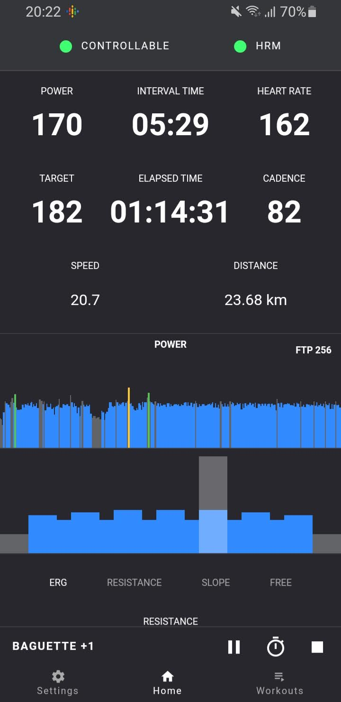
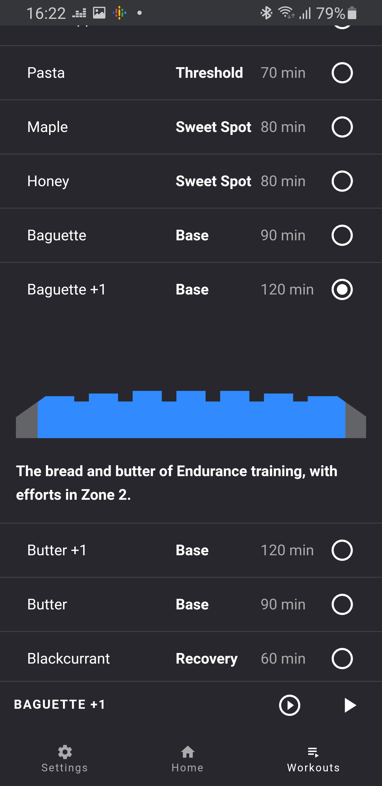
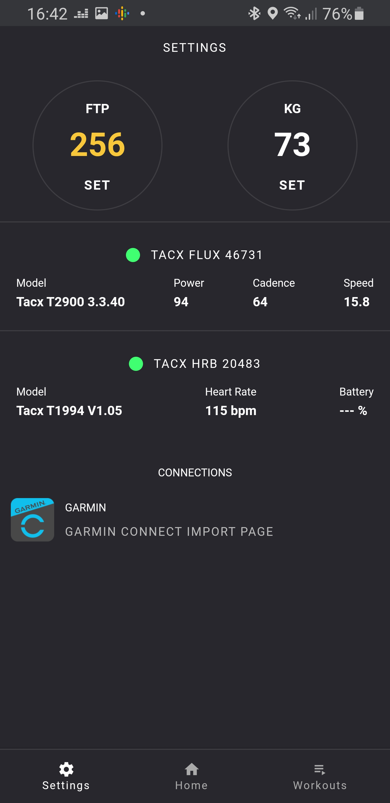

# Flux

Flux is an App for executing structured workouts on a smart trainer.

- executing Zwift .zwo workouts
- works with bluetooth smart trainers and heart rate monitors.
- ERG mode and extended manual control of your trainer with Grade Simulation and Resistance mode.
- recording .fit Activities compatible with all major platforms like Strava, Training Peaks, etc
- build-in collection of structured workouts to get you started
- keyboard controls

The web version is free to use and open source. It is developed as a serverless PWA, has zero dependancies and is completly independant to run.
Everything happens in your Browser and stays in there. It uses Web Bluetooth, IndexDB, Local Storage, WakeLock API, Vibration API.

## Screenshots

<table>
  <tr>
     <td>
       
     </td>
     <td>
       
     </td>
     <td>
       
     </td>
  </tr>
</table>

## Supported Platforms

A fully featured web version will be released by the end Jan 2021, and followed with desktop apps later.

The Web version is running directly in the browser and relies on some of the latest web platform technologies.
Browser support for the web version is the following:

| Chrome | Chrome Android | Edge | Opera | Opera Android | Samsung Internet | Safari | Safari iOS |
|--------|----------------|------|-------|---------------|------------------|--------|------------|
| yes    | yes            | yes  | yes   | no            | yes              | no     | no         |

### Linux
On Chrome for Linux you might need to turn on the experimental platforms feature flag at

`chrome://flags/#enable-experimental-web-platform-features`

### Opera

For Opera you might need to enable the web bluetooth flag at

`opera://flags/#enable-web-bluetooth`

### iOS
For iOS you can try [WebBLE](https://apps.apple.com/us/app/webble/id1193531073) which is:

> Very simple web browser that supports an initial subset of the web bluetooth.

It is not tested or supported by this project, but you can give it try if your only option is iOS.

## Supported Hardware

Works with all trainers that implement the bluetooth Fitness Machine Service (FTMS).

List of known trainers that implement FTMS:

- Tacx Flux 1 / S / 2
- Tacx Flow Smart 

- Elite Direto 
- Elite Suito
- Elite Tuo
- Elite Zumo 

- Saris H3
- Saris M2

- Wahoo Kickr Core
<!-- - Wahoo Snap  -->

List of major trainers without FTMS:

Tacx Neo / 2 / 2T (using custom bluetooth solution)
Wahoo Kickr (using custom bluetooth solution)

#### ANT+ FE-C

I am currently researching options for FE-C on the web. It just might work.

## The Demo
You can check a pre-release demo of the web version at [Demo](https://dvmarinoff.github.io/Flux/)

Keep in mind it is in active development and will change and break on daily bases, that's until the first stable version is released.

